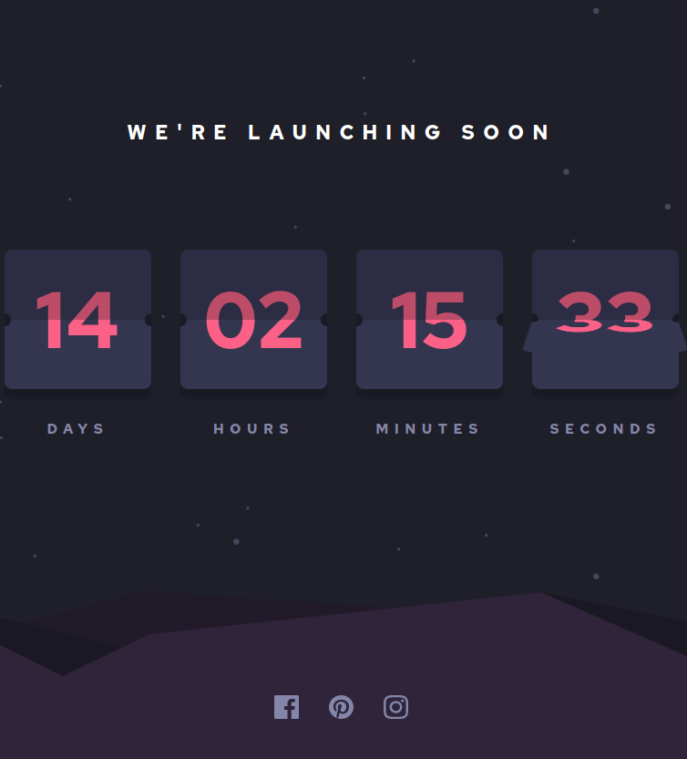

# Launch Countdown Timer, Solution

Immerse yourself in a dynamic countdown timer designed to elevate your anticipation. 

## Features
- See hover states for all interactive elements on the page
- See a live countdown timer that ticks down every second
- **Bonus**: When a number changes, make the card flip from the middle

## Installation

```
 git clone https://github.com/martindocs/launch-countdown-timer.git

 # cd into the project directory

 # If you have Live Server, visit http://localhost:5500 
 
 # Otherwise just double click index.html
```

## Screenshot



## Contributing

Pull requests are much appreciated and accepted.

1. <a href='https://help.github.com/articles/fork-a-repo/'>**Fork**</a> the repo on GitHub.
2. <a href='https://help.github.com/articles/cloning-a-repository/'>**Clone**</a> the project to your own machine.
3. <a href='https://git-scm.com/book/en/v2/Git-Basics-Recording-Changes-to-the-Repository'>**Commit**</a> changes to <a href='https://git-scm.com/book/en/v2/Git-Branching-Branches-in-a-Nutshell'>**development branch**</a>.
4. <a href='https://help.github.com/articles/pushing-to-a-remote/'>**Push**</a> your work back up to your fork.
5. Submit a <a href='https://help.github.com/articles/about-pull-requests/'>**Pull request**</a> so that i can review your changes

## Credits

This is a solution to the [Launch countdown timer challenge on Frontend Mentor](https://www.frontendmentor.io/challenges/launch-countdown-timer-N0XkGfyz-/hub/launch-countdown-timer-B1CJKq14c).

## License

**Launch Countdown Timer** is released under the MIT License. The terms of the license are as follows:

```
Copyright (c) 2022 Marcin Tatarski

Permission is hereby granted, free of charge, to any person obtaining
a copy of this software and associated documentation files (the
"Software"), to deal in the Software without restriction, including
without limitation the rights to use, copy, modify, merge, publish,
distribute, sublicense, and/or sell copies of the Software, and to
permit persons to whom the Software is furnished to do so, subject to
the following conditions:

The above copyright notice and this permission notice shall be
included in all copies or substantial portions of the Software.

THE SOFTWARE IS PROVIDED "AS IS", WITHOUT WARRANTY OF ANY KIND,
EXPRESS OR IMPLIED, INCLUDING BUT NOT LIMITED TO THE WARRANTIES OF
MERCHANTABILITY, FITNESS FOR A PARTICULAR PURPOSE AND
NONINFRINGEMENT. IN NO EVENT SHALL THE AUTHORS OR COPYRIGHT HOLDERS BE
LIABLE FOR ANY CLAIM, DAMAGES OR OTHER LIABILITY, WHETHER IN AN ACTION
OF CONTRACT, TORT OR OTHERWISE, ARISING FROM, OUT OF OR IN CONNECTION
WITH THE SOFTWARE OR THE USE OR OTHER DEALINGS IN THE SOFTWARE.
```
